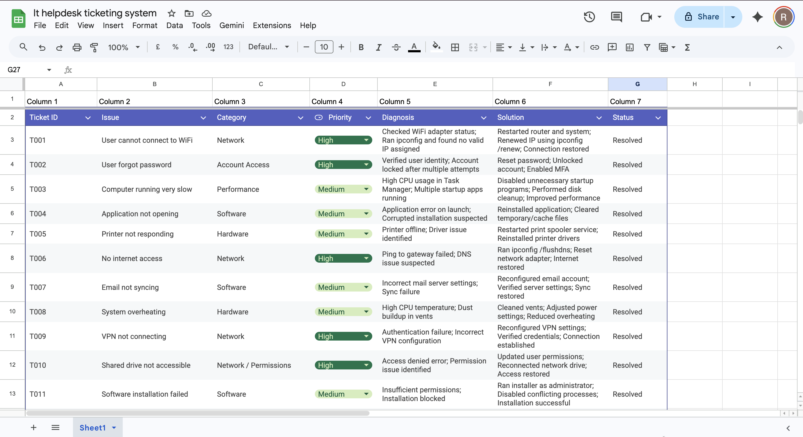
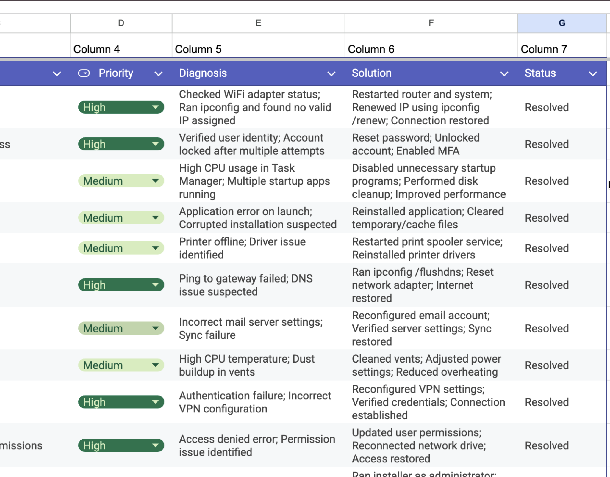

# IT Help Desk Ticketing System (Simulation)

## 📌 Overview
This project is a simulated IT Help Desk Ticketing System designed to demonstrate practical troubleshooting skills and real-world IT support workflows.

The system includes 15+ common IT support scenarios, covering network, system, software, and account-related issues. Each ticket follows a structured approach including diagnosis, solution, and resolution.

---

## 🎯 Purpose
The goal of this project is to:
- Practice real-world IT support problem-solving
- Demonstrate structured troubleshooting techniques
- Simulate a help desk environment used in IT support roles

---

## 🛠️ Tools Used
- Google Sheets (ticket management system)
- Basic IT troubleshooting tools and commands:
  - ipconfig
  - ping
  - system diagnostics tools

---

## 📂 Project Structure
The ticketing system includes the following fields:

- Ticket ID  
- Issue  
- Category  
- Priority  
- Diagnosis  
- Solution  
- Status  

---

## 🔧 Key Features
- Managed and resolved 15+ IT support tickets  
- Categorized issues into Network, Software, Hardware, and Account Access  
- Applied structured troubleshooting methods  
- Documented solutions for efficient issue resolution  
- Implemented priority-based issue handling  

---

## 🧠 Example Issues Covered
- WiFi connectivity issues  
- Password resets and account lockouts  
- Slow system performance  
- Software installation errors  
- Printer and hardware failures  
- Network and DNS issues  

---

## 📸 Screenshots

---

## 🚀 What I Learned
- How to approach technical issues systematically  
- How to diagnose and resolve common IT support problems  
- Importance of documentation in IT support workflows  
- Basics of help desk operations and ticket management  

---

## 📈 Future Improvements
- Build a web-based ticketing system  
- Add automation for ticket tracking  
- Integrate with a database backend  

---

## 👨‍💻 Author
Rehaan Chadha  
Business Technology Management Student  
Aspiring IT Support / Cybersecurity Profession
